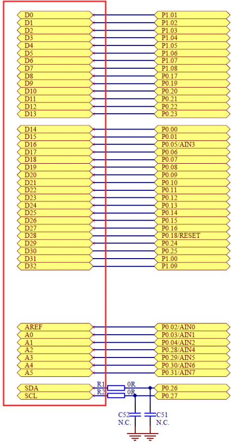

This is a "broken" version of the i2c code for the hall-effect sensor. It is for the MLX90393-SLQ-ABA-011-RE hall effect sensor with the datasheet here: [Datasheet](https://www.digikey.ca/en/products/detail/melexis-technologies-nv/MLX90393SLQ-ABA-011-RE/11506923)

### How to run

Here is the pin mapping for the nrf52840dk board.

Connect the following pins together

| Pin Name | NRF52840 Pin |
|----------|--------------|
| GND      | GND          |
| SCL      | P27          |
| SDA      | P26          |
| MS       | VDD          |
| INT      | GND (optional)  |
| VDD      | VDD          |

Connect to the terminal VCOM0

A demo application exists at [Melexis Driver for mlx90394](https://github.com/zephyrproject-rtos/zephyr/tree/v4.1.0-rc3/drivers/sensor/melexis)